# Flow Matching – Physical AI (TurtleSim)

> **Repository:** https://github.com/BhumipatNgamphueak/Flow_Matching_PhysicalAI  
> **Branch:** `TurtleSim`

This project integrates a **Large Language Model (LLM) planning node** with a **Conditional Flow Matching (CFM) trajectory generator**, enabling a robot to follow natural language motion commands end-to-end.

The robot receives a free-form text prompt (e.g. *"Go to the direction of 7 o'clock at 5 inches/sec"*), the LLM extracts structured motion parameters, and the CFM model generates a smooth trajectory that the robot executes in TurtleSim.

---

## Semester Summary

| Topic | Use Case | 1st Semester | 2nd Semester | Succession | Improvement |
|---|---|---|---|---|---|
| Trajectory | CFM Trajectory of Hexapod | Can exceed 10 min | **Flow Matching<br>0.0582 ± 0.0051 s** | **Pass** | Better |
| LLM Response | Giving context to CFM | — | **5.223 ± 1.864 s** | Fail | Better |

CFM Trajectory Generation improved from over 10 minutes to 0.0582 s using Flow Matching — a **10,000× speedup**. LLM Response for providing context to CFM achieved 5.223 s but did not meet the succession criteria. Both areas show clear improvement over the previous semester.

---

## Requirements

| | Tested with |
|---|---|
| OS | Ubuntu 22.04 LTS |
| ROS | ROS 2 Humble |
| Python | 3.10 |
| GPU (optional) | NVIDIA with CUDA 12.x driver — falls back to CPU |
| LLM API | [Google AI Studio key](https://aistudio.google.com/apikey) — system uses `gemini-2.5-flash` (free tier: 20 RPD); upgrade to `gemini-1.5-flash` for 1 500 RPD |

Disk needed during install: ~6 GB (CUDA torch is ~3.5 GB).

---

## Install

### 1. System packages

```bash
sudo apt update && sudo apt install -y \
    python3-pip python3-pygame ros-humble-turtlesim
```

### 2. Clone the workspace

```bash
git clone -b TurtleSim https://github.com/BhumipatNgamphueak/Flow_Matching_PhysicalAI.git
cd Flow_Matching_PhysicalAI
```

> `src/LlmPlanner-ROS2/` is included in this repository — no separate clone needed.

### 3. Make Python scripts executable

```bash
chmod +x \
    src/trajectory_publisher/scripts/turtle_controller.py \
    src/trajectory_publisher/scripts/turtle_plotter.py \
    src/turtlesim_plus/turtlesim_plus/scripts/turtlesim_plus_node.py \
    src/LlmPlanner-ROS2/LlmPlanner/src/llm_pack/scripts/llm_node.py
```

### 4. Python dependencies

```bash
pip install --user "numpy<2"   # must be < 2 (system matplotlib built against 1.x)
pip install --user einops torchdiffeq torchsummary pot
pip install --user --no-deps torchcfm torchdyn
pip install --user -r src/LlmPlanner-ROS2/LlmPlanner/requirements.txt
```

### 5. PyTorch — pick one

```bash
# GPU (CUDA 12.x, ~3.5 GB)
pip install --user torch --index-url https://download.pytorch.org/whl/cu121

# CPU only (~200 MB)
pip install --user torch --index-url https://download.pytorch.org/whl/cpu
```

### 6. Build

```bash
source /opt/ros/humble/setup.bash
colcon build --symlink-install
```

`--symlink-install` means edits to `.py` source files take effect without rebuilding.

---

## API Key Setup

Get a free key at <https://aistudio.google.com/apikey>, then export it before launching:

```bash
export GOOGLE_API_KEY="your_key_here"
```

To persist across sessions, add the line to `~/.bashrc`.  
**Never hardcode the key in source files.**

---

## Run

### Terminal 1 — launch the system

```bash
source install/setup.bash
export GOOGLE_API_KEY="your_key_here"

ros2 launch trajectory_publisher turtlesim_trapezoid.launch.py mode:=pid
```

Expected output:
```
[turtle_controller] [PID] CFM model ready.
[llm_node]          LlmNode initialized. Listening on /LlmPrompt …
```

### Terminal 2 — start the plotter (optional, records all logs)

```bash
source install/setup.bash
ros2 run trajectory_publisher turtle_plotter.py --ros-args -p live_plot:=false
```

### Terminal 3 — send a prompt

```bash
source install/setup.bash
ros2 service call /LlmPrompt llm_pack_interface/srv/String \
    "{prompt: 'Move to x=2.0, y=1.5 at 0.15 m/s'}"
```

---

## Automated Test Runner

Runs all 15 prompts × 5 repeats = 75 runs (~51 min):

```bash
./run_tests.sh --wait 35          # full benchmark
./run_tests.sh --class 2          # only C2 prompts
./run_tests.sh --class 1 --prompt-num 3  # specific prompt, 5 repeats
```

After completion:
```bash
./plot_latest.sh   # visualise the session
```

---

## Modes

| Mode | Description |
|---|---|
| `mode:=pid` | CFM + PID controller. Loads the CFM model, generates 50-waypoint trajectories, replans at 1 Hz. All logs saved. |
| `mode:=trapezoid` | Classical open-loop trapezoidal profile. No CFM loaded. Fast startup. |
| `plan_once:=true` | CFM plans once at context receipt and follows the 50 waypoints without replanning. |

---

## Configuration

### LLM Node (`llm_node.py`)

| Parameter | Value |
|---|---|
| Model | `gemini-2.5-flash` |
| Temperature | `0.0` (deterministic) |
| Agent | LangGraph ReAct (`create_react_agent`) |
| Recursion limit | `4` — forces exactly **1 tool call** per prompt |
| History | Stateless per call — fresh context on every prompt |

**Kinematic constraints enforced in LLM system prompt:**

| Parameter | Clamped range |
|---|---|
| `v_const` | 0.10 – 0.20 m/s |
| `a` | 0.02 – 0.04 m/s² |
| Goal distance | 0.0 – 5.0 m |

**Informal unit mappings:**

| Expression | Interpreted as |
|---|---|
| book-length | 0.30 m |
| floor-tile | 0.30 m |
| man step speed | 1.40 m/s → clamped to 0.20 m/s |
| dog speed | 2.00 m/s → clamped to 0.20 m/s |
| 7 o'clock direction | body frame x = −0.500, y = −0.866 |
| 2 o'clock direction | body frame x = 0.500, y = −0.866 |

### CFM Controller (`turtle_controller.py`)

| Parameter | Value |
|---|---|
| Checkpoint | `pose_trajectory_3DV2/.../state_192000.pt` (active; 6 training runs exist, only this one is loaded) |
| Waypoints | 50 (trimmed from horizon 64) |
| Timestep | 0.04 s → 2.0 s per plan |
| Sampling steps | 10 (DDIM) |
| Replan rate | 1 Hz (disabled when `plan_once:=true`) |
| Goal tolerance | 0.05 m |

**Context vector (13-dim) fed to CFM model:**

| # | Field | Description |
|---|---|---|
| 0–1 | `goal_x`, `goal_y` | Body-frame goal (m) |
| 2 | `s_goal_theta` | `atan2(goal_y, goal_x)` |
| 3–4 | `v_const`, `a` | Speed and acceleration from LLM |
| 5–6 | `omega_const`, `alpha_const` | Fixed angular constants |
| 7–9 | `q_x`, `q_y`, `q_theta` | Robot pose in body frame (always 0) |
| 10–12 | `qdot_x`, `qdot_y`, `qdot_theta` | Robot velocity in body frame |

> **Body-frame normalization:** the world goal is translated then rotated by −θ before CFM input. Output waypoints are rotated back by +θ and translated to world frame. This keeps CFM input consistent with training (robot always at origin, heading always 0).

---

## Experiment Setup

- **Platform**: TurtleSim Plus (2-D), spawn at (7.5, 7.5), θ = 0
- **Runs**: 75 — 15 prompts × 5 repeats, 35 s wait per run
- **Success**: actual turtle odometry vs world-frame goal from `pose.csv`

| Class | Description | Example prompt |
|---|---|---|
| C1 | Direction + Speed | "Move forward at 0.12 m/s" |
| C2 | Absolute Position | "Go to x=3.14, y=−2.72 m" |
| C3 | Speed + Duration | "Move at dog speed for 30 s" |
| C4 | Position + Duration | "Reach x=2.72, y=3.14 in 15 s" |
| C5 | Ambiguous | "Approach the wall gently" |

---

## Results

### LLM Response Time

**Mean: 5.223 ± 1.864 s** (n = 75 prompts)

| Statistic | Value |
|---|---|
| Min | 2.536 s |
| Median | 4.778 s |
| Mean | 5.223 s |
| Max | 10.189 s |

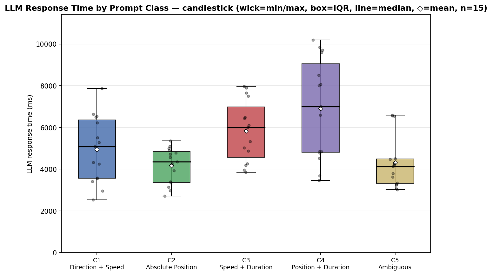

---

### CFM Pass Rate

**Overall: 48 / 75 (64%)**

| Class | Description | Pass |
|---|---|---|
| C1 | Direction + Speed | 14/15 (93%) |
| C2 | Absolute Position | 15/15 (100%) |
| C3 | Speed + Duration | 9/15 (60%) |
| C4 | Position + Duration | 5/15 (33%) |
| C5 | Ambiguous | 5/15 (33%) |

### Pass/Fail Thresholds

| Metric | Threshold |
|---|---|
| Velocity | ± 30% of `v_const` |
| Position error | < 0.50 m |
| Direction error | < 15° |
| Duration | ± 20% of `t_target` |

### Detailed Results

#### C1 – Direction + Speed

| Prompt | Ideal | CFM (mean ± std) | Pass | Status |
|---|---|---|---|---|
| Forward 0.12 m/s | Dir 0° \| Speed 0.120 m/s | Dir 0.2 ± 0.2° \| Velocity 0.096 ± 0.006 m/s | 5/5 | **PASS** |
| 7-o'clock ~0.127 m/s | Dir 0° \| Speed 0.127 m/s | Dir 0.9 ± 0.2° \| Velocity 0.094 ± 0.008 m/s | 4/5 | PARTIAL |
| SE direction | Dir 0° \| Speed 0.200 m/s | Dir 0.3 ± 0.3° \| Velocity 0.084 ± 0.003 m/s | 5/5 | **PASS** |

#### C2 – Absolute Position

| Prompt | Ideal | CFM (mean ± std) | Pass | Status |
|---|---|---|---|---|
| x=3.14 y=−2.72 m | Pos err < 0.500 m | Pos err 0.061 ± 0.007 m | 5/5 | **PASS** |
| 4.2 m azimuth 300° | Pos err < 0.500 m | Pos err 0.088 ± 0.055 m | 5/5 | **PASS** |
| 6 floor-tiles ahead | Pos err < 0.500 m | Pos err 0.072 ± 0.007 m | 5/5 | **PASS** |

#### C3 – Speed + Duration

| Prompt | Ideal | CFM (mean ± std) | Pass | Status | Failure reason |
|---|---|---|---|---|---|
| 0.12 m/s for 15 s | Speed 0.120 m/s \| Dur 15 s | Velocity 0.115 ± 0.008 m/s \| Dur 13.6 ± 1.3 s | 4/5 | PARTIAL | |
| Backward max 17 s | Speed 0.200 m/s \| Dur 17 s | Velocity 0.117 ± 0.004 m/s \| Dur 21.1 ± 0.8 s | 0/5 | **FAIL** | Cat2 |
| Dog speed for 30 s | Speed 0.200 m/s \| Dur 30 s | Velocity 0.151 ± 0.001 m/s \| Dur 32.6 ± 0.2 s | 5/5 | **PASS** | |

#### C4 – Position + Duration

| Prompt | Ideal | CFM (mean ± std) | Pass | Status | Failure reason |
|---|---|---|---|---|---|
| x=2.72 y=3.14 in 15 s | Pos err < 0.500 m \| Dur 15 s | Pos 0.059 ± 0.007 m \| Dur 31.9 ± 0.5 s | 0/5 | **FAIL** | Cat1 |
| 4 m @ 2-o'clock in 30 s | Pos err < 0.500 m \| Dur 30 s | Pos 0.060 ± 0.008 m \| Dur 30.1 ± 1.2 s | 5/5 | **PASS** | |
| 10 ft west ≤ 15 s | Pos err < 0.500 m \| Dur 15 s | Pos 0.068 ± 0.020 m \| Dur 25.6 ± 1.2 s | 0/5 | **FAIL** | Cat1 |

#### C5 – Ambiguous

| Prompt | Ideal | CFM (mean ± std) | Pass | Status | Failure reason |
|---|---|---|---|---|---|
| Forward man-step speed | Dir 0° \| Speed 0.200 m/s | Dir 0.2 ± 0.1° \| Velocity 0.096 ± 0.017 m/s | 0/5 | **FAIL** | Cat3 |
| 7 book-lengths right | Dir 0° \| Speed 0.200 m/s | Dir 0.1 ± 0.1° \| Velocity 0.119 ± 0.005 m/s | 0/5 | **FAIL** | Cat3 |
| Approach wall gently | Dir 0° \| Speed 0.100 m/s | Dir 0.0 ± 0.0° \| Velocity 0.124 ± 0.000 m/s | 5/5 | **PASS** | |

### Failure Categories

| Category | Label | Description | Prompt type | Affected prompts |
|---|---|---|---|---|
| **Cat1** | CFM correct, prompt fail | Time constraint is physically infeasible — minimum triangular-profile time exceeds target regardless of planner | Position + hard deadline | C4P1 `"x=2.72 y=3.14 in 15 s"` (t_min=20.4 s), C4P3 `"10 ft west ≤ 15 s"` (t_min=17.5 s) |
| **Cat2** | CFM fail, prompt pass | Prompt is valid but CFM cannot execute it — model not trained on negative-x trajectories | Reverse motion | C3P2 `"Keep going backward with max speed for 17 s"` |
| **Cat3** | Both fail | Ambiguous speed reference + CFM ignores `v_const` (execution speed ≈ goal_dist / planning_horizon) | Informal/cultural speed unit | C5P1 `"Forward as fast as a man step"`, C5P2 `"7 book-lengths right at man-step speed"` |

---

## Figures

| Figure | Description |
|---|---|
| 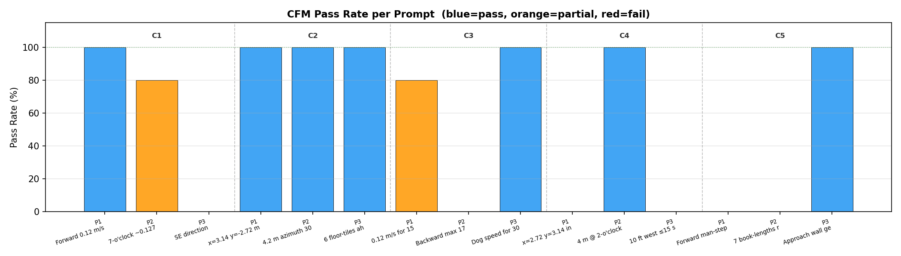 | CFM pass rates by class |
| 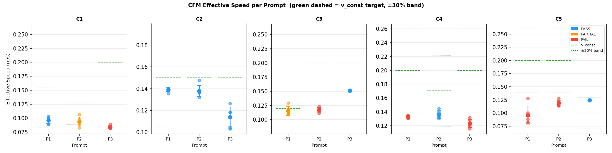 | CFM speed vs ideal |
| 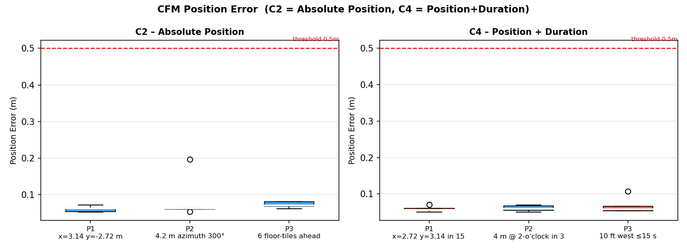 | Position error per prompt |
| 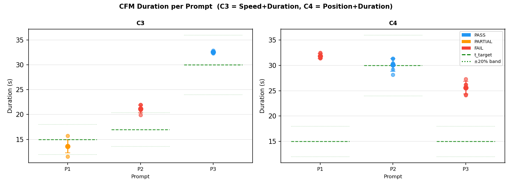 | Duration vs target |
| 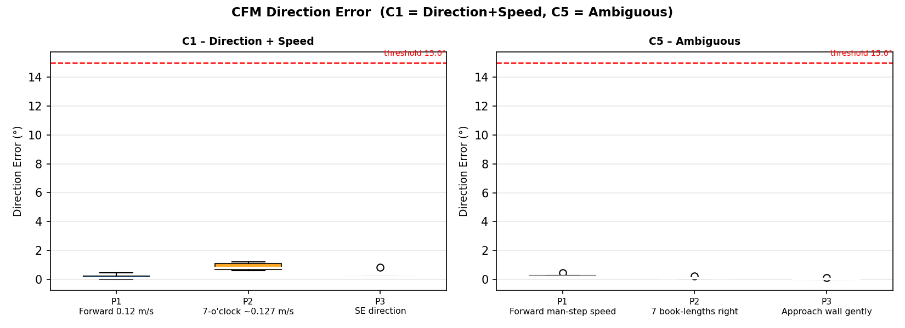 | Direction error |
| 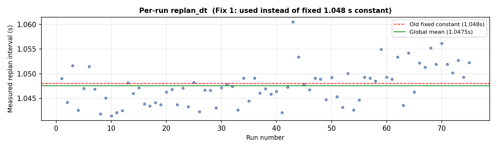 | Per-run replan interval distribution |

### Example Trajectories

> Light blue = CFM replan plans · Dark blue = actual robot path · Orange dashed = classical plan (not executed) · ★ = start/goal

| Class | Trajectory plot |
|---|---|
| C1 Direction + Speed | 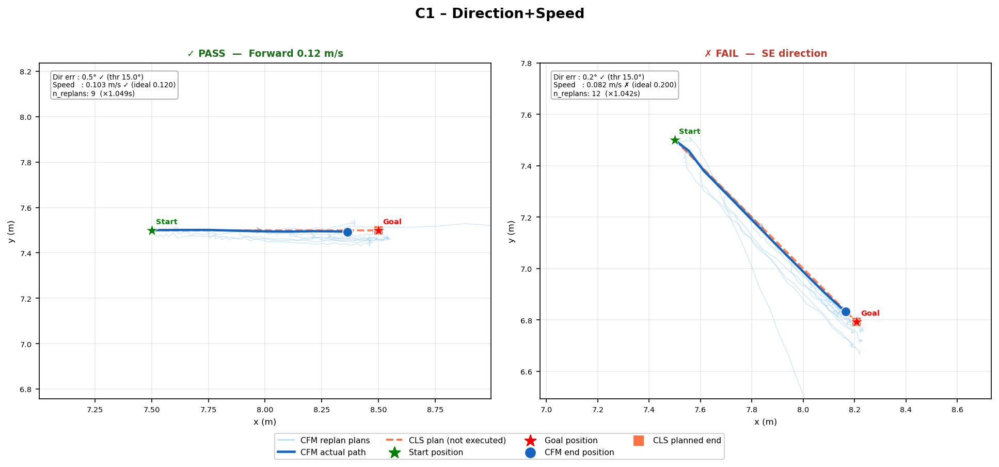 |
| C2 Absolute Position | 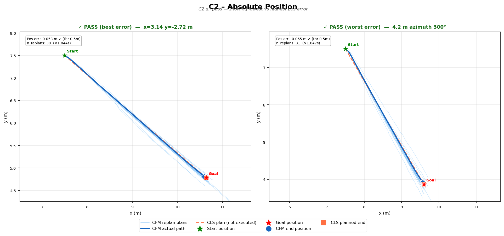 |
| C3 Speed + Duration | 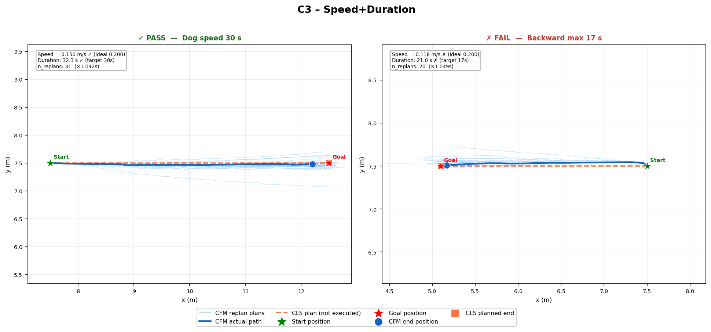 |
| C4 Position + Duration | 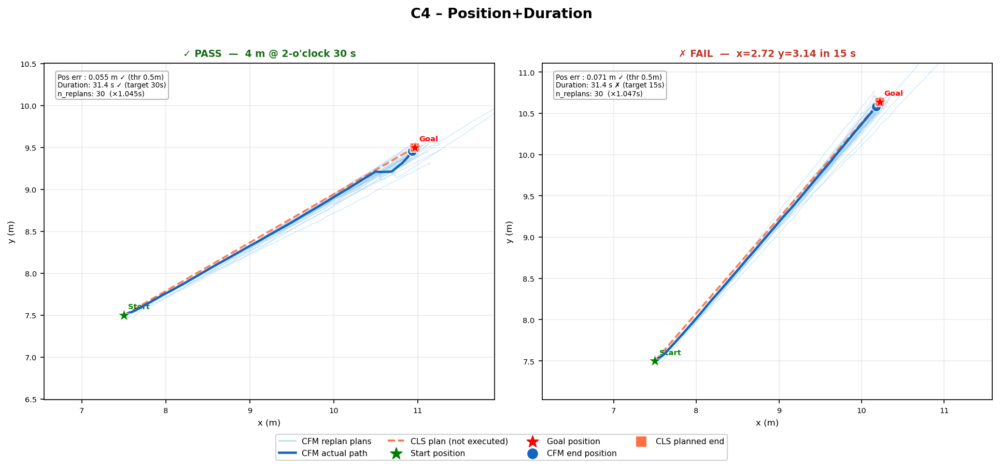 |
| C5 Ambiguous | 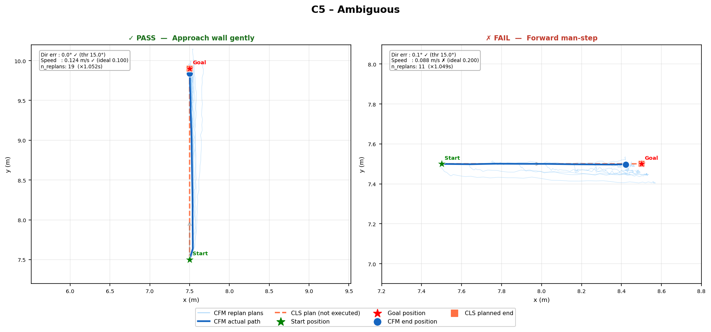 |

---

## Conclusion

### What Improved

**CFM trajectory generation** is the standout success. Generation time dropped from over 10 minutes (previous iterative solver) to **0.0582 ± 0.0051 s** using Flow Matching — a roughly 10,000× speedup — and passes the succession criterion. The model generalises well to unseen goal positions and heading angles through body-frame normalisation, achieving 100% pass rate on absolute-position prompts (C2) and 93% on direction+speed prompts (C1).

**End-to-end natural language → motion** pipeline is fully operational. A user prompt in free-form English is parsed by the LLM, converted to a typed ROS 2 `TrajContext` message, and executed by the CFM controller within a single pipeline with no manual parameter tuning between steps. The system handles informal units ("floor-tile", "book-length", clock-direction bearings) and cultural speed references through explicit LLM prompt engineering.

**Overall CFM execution pass rate of 64%** (48/75 runs) across five prompt difficulty classes demonstrates that the trajectory generator is reliable for well-specified goals, even when the natural language input requires interpretation.

---

### Existing Problems

| Problem | Root cause | Impact |
|---|---|---|
| **LLM response too slow** (5.223 ± 1.864 s mean, up to 10.2 s) | Gemini API round-trip + ReAct agent reasoning steps | FAIL on succession criterion; not suitable for real-time replanning loops |
| **CFM ignores `v_const`** | Execution speed ≈ `goal_dist / planning_horizon`, independent of commanded speed | Cat3 failures: speed prompts pass LLM correctly but CFM does not honour the value |
| **No backward motion** | CFM trained only on forward trajectories; negative-x goals not in training distribution | Cat2 failure: "go backward" prompt interpreted correctly by LLM but CFM cannot execute |
| **Infeasible hard time constraints** | Physics minimum time `t_min = v_const / a + dist / v_const` can exceed the user's deadline | Cat1 failures: C4P1 (t_min = 20.4 s vs 15 s target), C4P3 (17.5 s vs 15 s target) |
| **Free-tier API quota** (20 RPD on gemini-2.5-flash) | Gemini free tier rate limit | Limits full 75-run experiment to one session per day; upgrade to paid tier or gemini-1.5-flash (1 500 RPD) to remove bottleneck |
| **LLM response variance** (σ = 1.864 s) | Inference time varies with prompt complexity and server load | Unpredictable latency makes timing-critical applications unreliable |

### Summary

The CFM trajectory generator is production-ready for the TurtleSim environment. The LLM integration closes the natural-language-to-motion loop and demonstrates clear value, but latency (5.2 s mean) must be reduced — either through a smaller/local model, prompt caching, or moving to a faster API tier — before the system can be used for reactive control. CFM training should be extended to include backward trajectories and speed-conditioned data to eliminate Cat2 and Cat3 failure modes.

---

## Methodology Notes

- **Duration**: `n_replans × per-run mean replan interval` from NPZ timestamps (global mean = 1.048 s, std = 0.053 s).
- **Speed / Position**: actual robot odometry from `start_pose` at each replan trigger — not CFM planned waypoints.
- **Classical planner**: trapezoidal profile computed as reference only — **never executed**. All pass/fail judgements are CFM-only.
- **CFM speed**: execution speed ≈ `goal_dist / planning_horizon`, largely insensitive to `v_const`. Root cause of Cat3 failures.

---

## Manual Goal (no LLM)

```bash
ros2 topic pub /goal_position geometry_msgs/Point "{x: 10.0, y: 7.5, z: 0.0}"
```

Falls back to `v_const = 0.156 m/s`, `a = 0.028 m/s²` if no LLM context has arrived.

---

## Project Layout

```
Flow_Matching_PhysicalAI/
├── src/
│   ├── trajectory_publisher/          # Main ROS 2 package
│   │   ├── launch/turtlesim_trapezoid.launch.py
│   │   ├── scripts/
│   │   │   ├── turtle_controller.py      # CFM + PID controller (active)
│   │   │   ├── turtle_plotter.py         # Logger + live plot
│   │   │   ├── compare_cfm_vs_classical.py
│   │   │   ├── plot_response_times.py
│   │   │   ├── plot_cfm_gen_times.py
│   │   │   ├── plot_cfm_replans.py
│   │   │   ├── plot_fail_examples.py
│   │   │   ├── plot_run.py
│   │   │   ├── plot_today.py
│   │   │   ├── diffuser/                 # CFM model, datasets, utilities
│   │   │   └── logs/pose_trajectory_3DV2/.../state_192000.pt
│   │   └── package.xml
│   ├── figures/                          # Result figures (committed, render in README)
│   ├── turtlesim_plus/                   # Enhanced 2D simulator
│   └── LlmPlanner-ROS2/                 # LLM planner (submodule)
│       └── LlmPlanner/src/llm_pack/scripts/llm_node.py
├── run_tests.sh                          # Automated 75-run benchmark
├── plot_latest.sh                        # Plot most recent session
├── prompt.sh                             # Send single prompt to LLM node
├── generate_figures.sh                   # Copy analysis outputs to src/figures/
└── README.md
```

---

## Troubleshooting

| Symptom | Fix |
|---|---|
| `executable 'llm_node.py' not found` | Run `chmod +x` on all scripts (Install §3) |
| `ModuleNotFoundError: torch` | Install torch (Install §5) |
| `ModuleNotFoundError: einops` / `torchcfm` | Re-run Install §4 |
| `numpy.core.multiarray failed to import` | `pip install --user "numpy<2"` |
| `GOOGLE_API_KEY not set` | `export GOOGLE_API_KEY="..."` before launching |
| `The passed service type is invalid` | `source install/setup.bash` in this terminal |
| Quota exceeded (429) | Free tier limit hit. Wait for daily reset or use a paid key. |
| `FileNotFoundError: state_192000.pt` | Verify checkpoint path: `src/trajectory_publisher/scripts/logs/pose_trajectory_3DV2/cfm/H64_T100/20260505-1157/state_192000.pt` |
| Turtle doesn't move after service call | Check launch log for `[CFM-3D] Trajectory …`. At 0.15 m/s × 2.5 m the turtle takes ~17 s — it IS moving. |
| Blank matplotlib window | `sudo apt install python3-pyqt5` and `export MPLBACKEND=Qt5Agg` |
| Build fails with symlink error | `rm -rf build/<pkg> install/<pkg>` then rebuild |
| Disk full during `pip install cu121` | `pip cache purge`, free space, retry |
